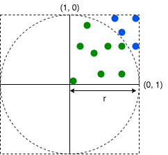
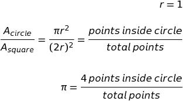

# estimate-pi-random
Estimate pi based on random numbers. Each pair of numbers represents a point in a Cartesian system.  
If we draw the inscribed circumference, we can estimate pi as 4 times the ratio between points inside the circumference and total of points.  
The more points, the more accuracy of pi.

  

